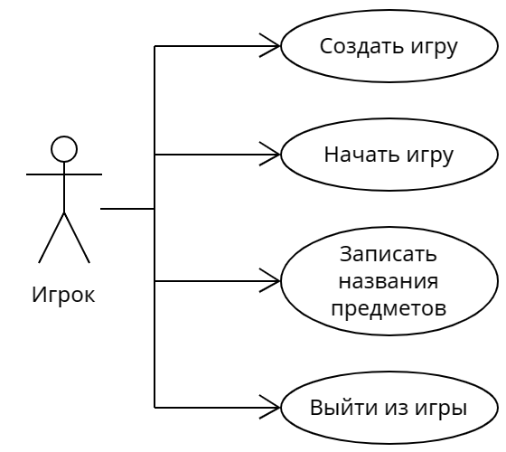

# Лабораторная работа №1
##### 10. Веселая игра «Запомни предметы»
### Диаграмма вариантов использования (use-case)

### Прецедент "Создать игру"
Описание: Игрок создаёт новую игру, указывая количество игроков.
* Основной исполнитель: Игрок
* Предусловие: Приложение запущено
* Постусловие: Игра с указанным количеством игроков создана

#### Основной сценарий
|Пользователь|Система|
|-|-|
|1. Указывает количество игроков||
|2. Нажимает кнопку "Подтвердить"||
||3. Фиксирует выбранные параметры|
||4. Создаёт игру|

### Прецедент "Играть"
Описание: На экране появляются предметы, в течение двух минут игрок их просматривает, затем записывает названия тех предметов, которые запомнил, в поля для ввода. Если игроков несколько, ход передаётся от одного к другому, пока все не завершат ввод. В конце игры выводятся результаты. 
* Основной исполнитель: Игрок
* Предусловие: Игра создана
* Постусловие: Отображены результаты игры

#### Основной сценарий (для одного игрока)
|Пользователь|Система|
|-|-|
|1. Нажимает кнопку "Играть".||
||2. Создаёт список предметов и изображение с ними.|
||3. Отображает предметы на экране.|
||4. По истечении времени скрывает предметы с экрана и отображает поля для ввода названий предметов.|
|5. Вводит названия запомненных предметов в поля.||
|6. Нажимает кнопку "Готово".||
||7. Фиксирует список введённых предметов и сравнивает его с изначальным списком.|
||8. Выводит на экран изображение с предметами и результат игрока.|

#### Альтернативный сценарий (для нескольких игроков )
|Пользователь|Система|
|-|-|
|1. Нажимает кнопку "Играть".||
||2. Создаёт список предметов и изображение с ними.|
||3. Отображает предметы на экране.|
||4. По истечении времени скрывает предметы с экрана и отображает поля для ввода названий предметов.|
|5. Вводит названия запомненных предметов в поля.||
|6. Нажимает кнопку "Готово".||
||7. Фиксирует список введённых предметов и сравнивает его с изначальным списком.|
||8. Очищает поля для ввода и передаёт ход другому игроку.|
||9. Когда последний игрок нажимает кнопку "Готово", выводит на экран изображение с предметами и рейтинговую таблицу.|

### Прецедент "Выйти из игры"
Описание: Игрок выходит из приложения.
* Основной исполнитель: Игрок
* Предусловие: Приложение запущено
* Постусловие: Приложение закрыто

#### Основной сценарий
|Пользователь|Система|
|-|-|
|1. Нажимает кнопку "Выйти из игры".||
||2. Завершает работу приложения.|