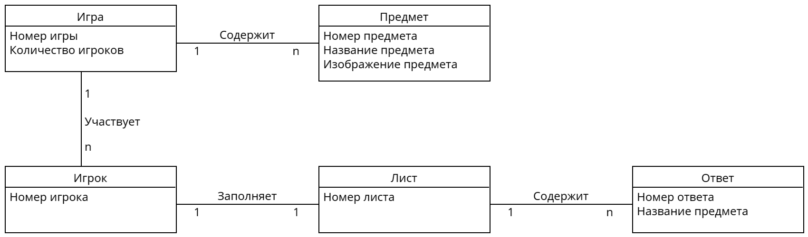

# Лабораторная работа №2
##### 10. Веселая игра «Запомни предметы»
## Диаграмма классов

#### Игрок - Игра
Пользователь создаёт игру и указывает количество игроков. Номер игры генерируется автоматически.
В одной игре может участвовать несколько игроков.
#### Игра - Предмет
Игра содержит в себе список из случайных предметов, которые отображаются игрокам в начале игры, когда идёт время для запоминания.
В одной игре содержится несколько предметов.
#### Игрок - Лист
Игрок записывает на листе названия тех предметов, которые запомнил, и передаёт их системе. Каждый игрок заполняет только один лист.
#### Лист - Ответ
Список введённых игроком названий предметов сравнивается с действительным списком предметов, содержащихся в игре.
В листе может содержаться несколько ответов.