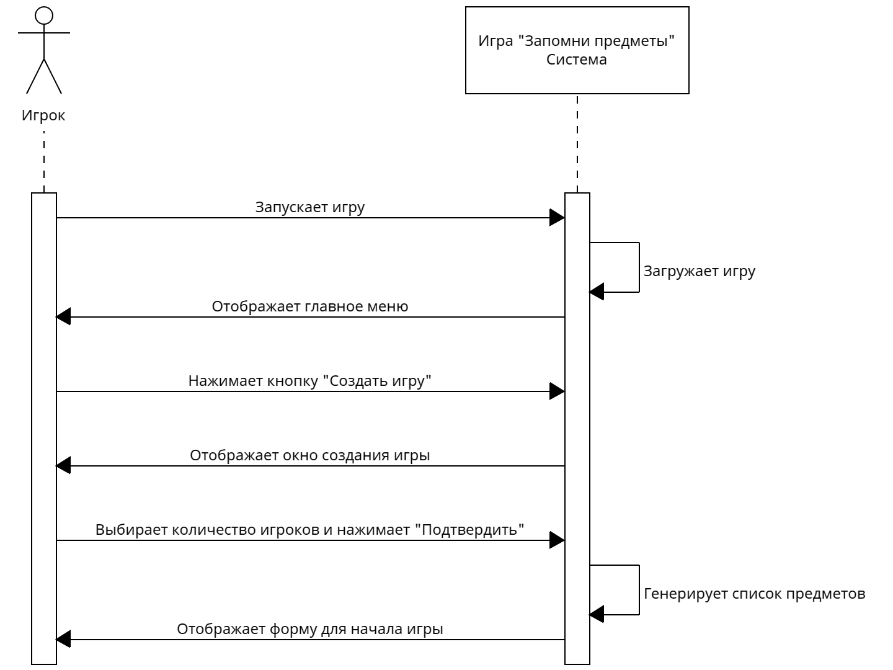
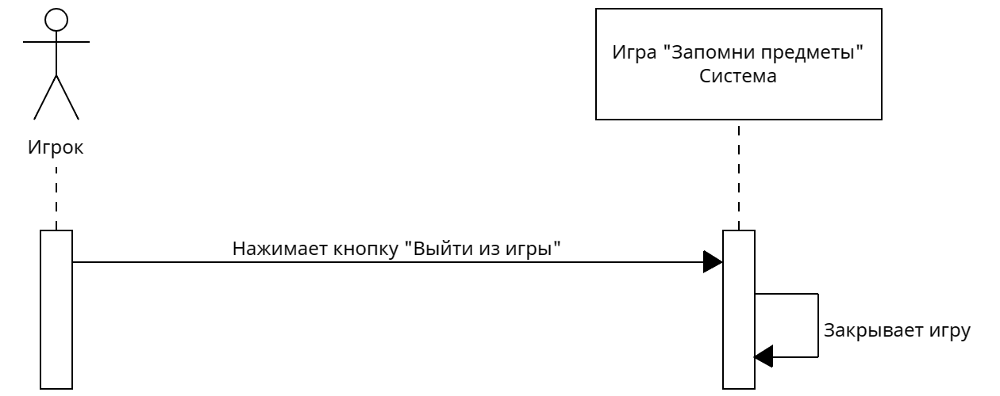

# Лабораторная работа №3
##### 10. Веселая игра «Запомни предметы»
### Процедент "Создать игру"

|Операция|Отображение главного меню|
|-|-|
|Ссылки|Прецедент "Создать игру"|
|Предусловие|Игра запущена|
|Постусловие|Отображено главное меню игры|

|Операция|Отображение формы создания игры|
|-|-|
|Ссылки|Прецедент "Создать игру"|
|Предусловие|Нажата кнопка "Создать игру"|
|Постусловие|Отображена форма создания игры|

|Операция|Отображение формы для начала игры|
|-|-|
|Ссылки|Прецедент "Создать игру"|
|Предусловие|Нажата кнопка "Подтвердить"|
|Постусловие|Отображена форма для начала игры|

### Процедент "Начать игру"

|Операция|Отображение предметов|
|-|-|
|Ссылки|Прецедент "Начать игру"|
|Предусловие|Нажата кнопка "Играть"|
|Постусловие|Истекло время отображения предметов|

|Операция|Отображение формы для записи названий предметов|
|-|-|
|Ссылки|Прецедент "Начать игру"|
|Предусловие|Нажата кнопка "Далее"|
|Постусловие|Отображена форма для записи названий предметов|

### Процедент "Записать названия предметов"

|Операция|Запись названий предметов|
|-|-|
|Ссылки|Прецедент "Записать названия предметов"|
|Предусловие|Отображена форма для записи названий предметов|
|Постусловие|Нажата кнопка "Готово"|

|Операция|Отображение формы с результатами игрока|
|-|-|
|Ссылки|Прецедент "Записать названия предметов"|
|Предусловие|Нажата кнопка "Готово"|
|Постусловие|Отображена форма с результатами игрока|

|Операция|Отображение формы с рейтинговой таблицей|
|-|-|
|Ссылки|Прецедент "Записать названия предметов"|
|Предусловие|Всеми игроками нажата кнопка "Готово"|
|Постусловие|Отображена форма с рейтинговой таблицей|

### Процедент "Выйти из игры"

|Операция|Выход из игры|
|-|-|
|Ссылки|Прецедент "Выйти из игры"|
|Предусловие|Нажата кнопка "Выйти из игры"|
|Постусловие|Игра закрыта|
