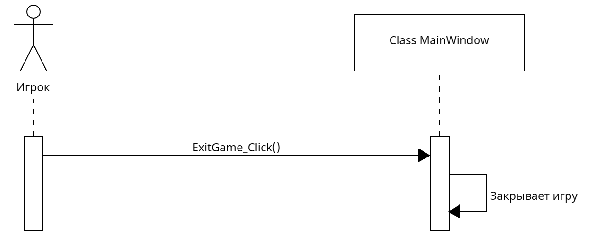

# Лабораторная работа №4
##### 10. Веселая игра «Запомни предметы»
## Диаграммы последовательностей внутри системы
### Классы
### Прецедент "Создать игру"

|Операция|MainWindow()|
|-|-|
|Ссылки|Прецедент "Создать игру"|
|Предусловие|Игра запущена|
|Постусловие|Отображено главное меню игры MainWindow|

|Операция|CreateGameWindow()|
|-|-|
|Ссылки|Прецедент "Создать игру"|
|Предусловие|Нажата кнопка "CreateGame"|
|Постусловие|Отображена форма создания игры CreateGameWindow|

|Операция|ReadyToPlayWindow(playerCount)|
|-|-|
|Ссылки|Прецедент "Создать игру"|
|Предусловие|Нажата кнопка "Confirm"|
|Постусловие|Отображена форма для начала игры ReadyToPlayWindow|

### Прецедент "Начать игру"

|Операция|GameWindow(playerCount, items)|
|-|-|
|Ссылки|Прецедент "Начать игру"|
|Предусловие|Нажата кнопка "Play"|
|Постусловие|Истекло время отображения предметов|

|Операция|InputWindow(playerCount, items)|
|-|-|
|Ссылки|Прецедент "Начать игру"|
|Предусловие|Истекло время отображения предметов|
|Постусловие|Отображена форма для записи названий предметов InputWindow|

### Прецедент "Записать названия предметов"

|Операция|Запись названий предметов|
|-|-|
|Ссылки|Прецедент "Записать названия предметов"|
|Предусловие|Отображена форма для записи названий предметов InputWindow|
|Постусловие|Нажата кнопка "SubmitButton"|

|Операция|ResultWindow(playerResults)|
|-|-|
|Ссылки|Прецедент "Записать названия предметов"|
|Предусловие|Всеми игроками нажата кнопка "SubmitButton"|
|Постусловие|Отображена форма с рейтинговой таблицей ResultWindow|

### Прецедент "Выйти из игры"

|Операция|Выход из игры|
|-|-|
|Ссылки|Прецедент "Выйти из игры"|
|Предусловие|Нажата кнопка "ExitGame"|
|Постусловие|Игра закрыта|
